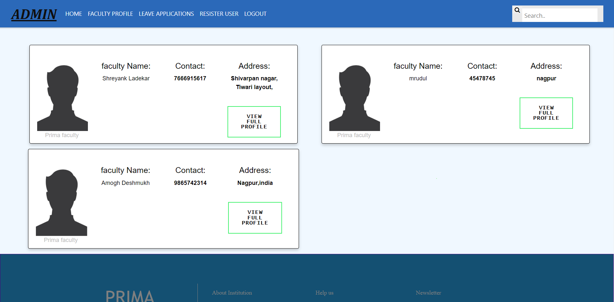
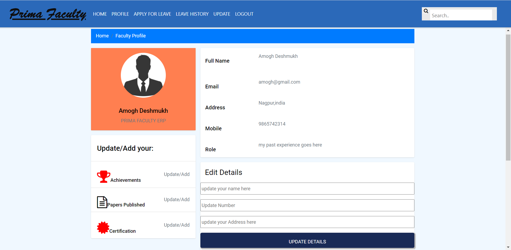

# PRIMA FACULTY ERP 
Idea behind this application is to provide easy maintenance of records of faculties in a particular institute/organisation.Faculty can maintain there profile by easy to use features.

## Technical overview.
This  is a full stack web application which uses Angular/Ionic to design frontend. Backend programming is done using django framework while MongoDB database is used to store user data.

<!-- 

   
   
   

 -->

### Steps to run the project
1. For front end, Install Nodejs in your system, then install anugular using npminstall-g@angular/cli , then install inonic using:  $npminstall -g @ionic/cli 

2. For backend run command: pip install Django

3. Open the backend folder in preferred IDE and run: python3 manage.py runserver

4. Now open frontend folder and  run the project using command: ionic serve.

#### Pull requests are welcome. For major changes, please open an issue first to discuss what you would like to change.

